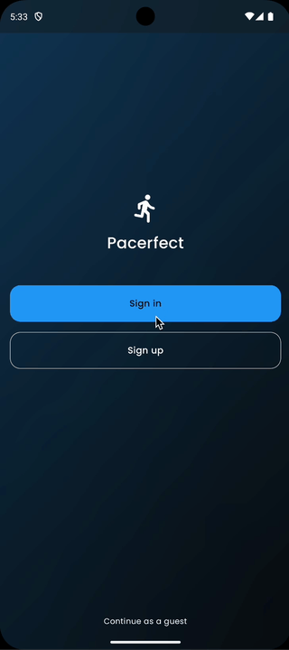

# Pacerfect

Pacerfect is building with MVI architecture with Jetpack Compose.

## Feature

**Pacerfect** is a Offline first tracking run app with Google Map.

### Auth



### Overview


### Track Run


### Analytics


## Build

You'll need Google Map API key to run this project.

Include it in `local.properties`:

```
MAPS_API_KEY=<GOOGLE_MAPS_API_KEY>
```